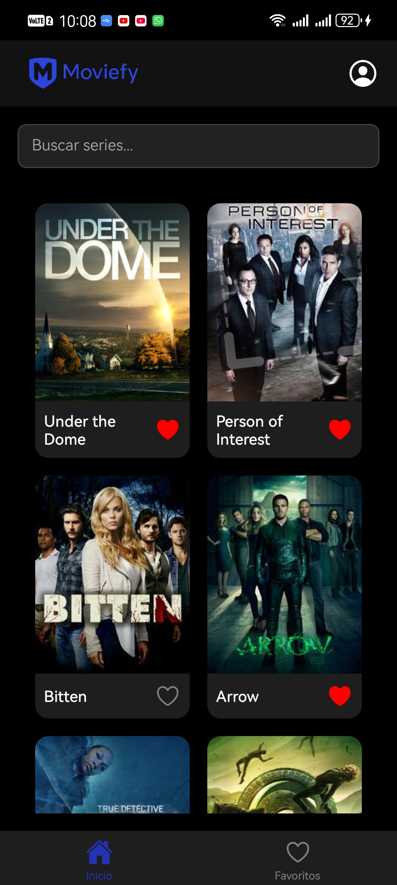
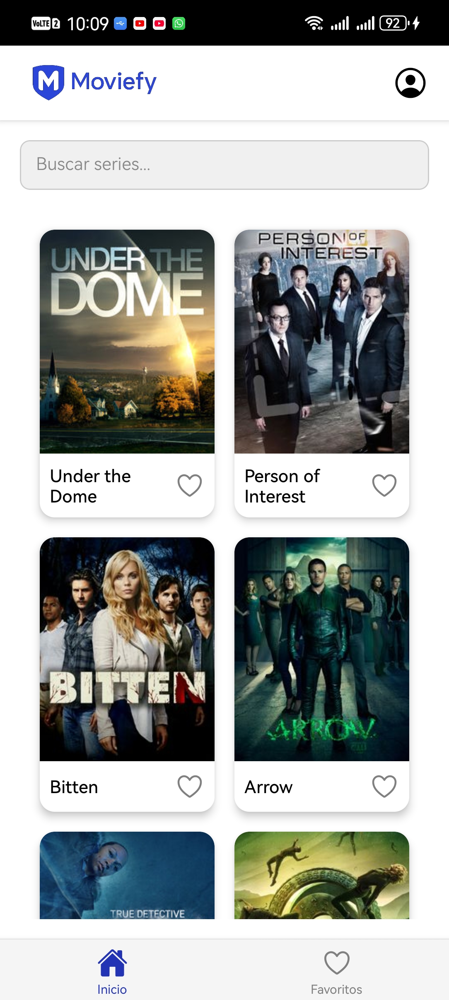
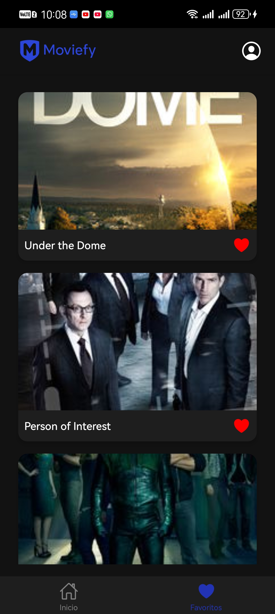
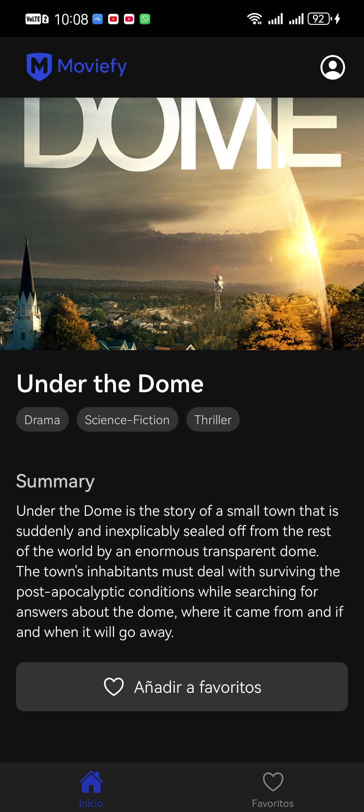
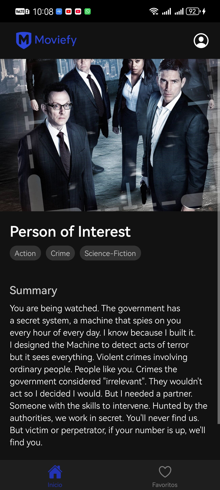

# Moviefy 📺

Aplicación móvil desarrollada con **React Native** para explorar y gestionar tus series favoritas utilizando la API de [TVMaze](https://www.tvmaze.com/api).

---

## 📲 Características

- 🔍 **Explora series** populares de TV.
- 💖 **Agrega series a favoritos** con un solo toque.
- 🌙 **Modo claro/oscuro** automático según la configuración del dispositivo.
- 🖼 **Vista de detalles** de cada serie (con imagen, resumen y más).
- 🔎 **Buscador de series** (consulta directa a la API de TVMaze).

---

## 🛠️ Tecnologías utilizadas

- [React Native](https://reactnative.dev/)
- [TypeScript](https://www.typescriptlang.org/)
- [React Navigation](https://reactnavigation.org/)
- [TVMaze API](https://www.tvmaze.com/api)

---

## 🚀 Instalación

1. Clona el repositorio

```bash
git clone https://github.com/LlamosasNG/Moviefy.git
cd Moviefy
```

2. Instala Dependencias

```bash
npm install
```

3. Instala las dependencias de navegación (React Navigation)

```bash
npm install @react-navigation/native
npm install react-native-screens react-native-safe-area-context react-native-gesture-handler react-native-reanimated
npm install @react-navigation/bottom-tabs
npm install @react-navigation/stack
npm install react-native-vector-icons
```

4. Link de las fuentes de iconos (solo en Android)

```bash
npx react-native link react-native-vector-icons
```

5. Ejecuta la app

```bash
npx react-native run-android
npx react-native start
```

---

### 📸 Funcionamiento de la app

### Home

| Home A                                                | Home B                                                |
| ----------------------------------------------------- | ----------------------------------------------------- |
|  |  |

### Favoritos



### Detalles

| Detalles 1                                         | Detalles 2                                         |
| -------------------------------------------------- | -------------------------------------------------- |
|  |  |

---

### 💻 Autores

Desarrollado por:

- Hernández Hernández Roberto Isaac
- Gonzalez Llamosas Noe Ramses
